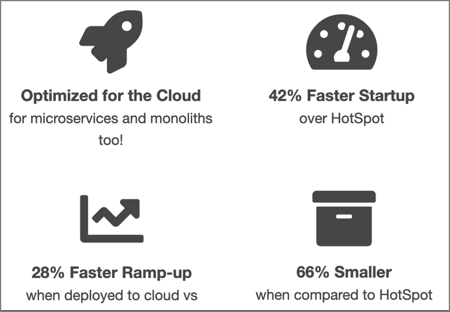

# IBM Semeru Runtimes now available from Eclipse Adoptium Marketplace

## What is IBM Semeru Runtimes?

IBM Semeru Runtimes is IBM's supported open source version of the Java JDK.

Similar to other vendors offerings, Semeru Runtimes is built on the latest open source release of OpenJDK provided by AdoptOpenJDK.

What seperates Semeru Runtimes from the others is that it includes the highly acclaimed OpenJ9 JVM.

## What is OpenJ9?

`OpenJ9` is an open source JVM provided by the Eclipse Foundation, and has been available since 2017.

`OpenJ9` began life some 15 years earlier as simply `J9`. Developed by IBM, `J9` has been used by all IBM Java based customers for all types of workloads - from medical, to banking and research.

As a major contributor to open source projects, IBM moved the development and governance of the `J9` JVM to the Eclipse Foundation, and re-branded the name to `OpenJ9`.

## How does OpenJ9 compare against other JVMs?

Optimized for the cloud and running in constrained environments, `OpenJ9` has the following advantages:

* Uses dramatically less memory without sacrificing application responsiveness.
* Provides AOT (Ahead of Time compilation) capabilities using shared cache between instances.
* Provides a remote JIT compiler (JITServer) to offload CPU cycles and memory spikes from the application instance.

## How do I get it?

Up until recently, the one way to download the IBM Semeru Runtimes was from the [IBM Developer site](https://developer.ibm.com/languages/java/semeru-runtimes/downloads/).

But this all changed with the recent announcement from Eclipse Adoptium.

## What is Eclipse Adoptium?

Eclipse Adoptium is the central distribution site for downloading TCK certified runtimes for the Java ecosystem.

>**NOTE**: TCK stands for Technology Compatibility Kit - a suite of tests to ensure compliance with the latest Java specification.

Until recently, AdoptOpenJDK provided this service. But with the ever-growing ecosystem of Java runtimes being developed, it was decided to move this effort to the Eclipse Foundation. This new project was re-branded as Eclipse Adoptium.

## Will Eclipse Adoptium support IBM Semeru Runtimes?

In a word, Yes!

Which gets to the main point of this blog.

Starting in May 2022, Eclipse Adoptium has added a marketplace site where vendors can provide downloads to their JDK builds.

IBM will be included, and will be the only offering that provides the OpenJ9 JVM.

Some vendors will provide their own proprietary solutions, but most will simply include the standard HotSpot JVM from Oracle.

## Summary

There are now two ways to download IBM Semeru Runtimes:

* [IBM Developer](https://developer.ibm.com/languages/java/semeru-runtimes/downloads/)
* [Eclipse Adoptium Marketplace](TBD)

## Related articles

TBD
