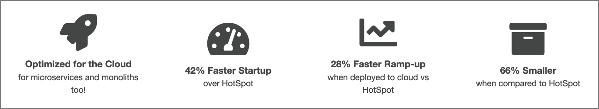

# IBM Semeru Runtimes now available from Eclipse Adoptium Marketplace

## What is IBM Semeru Runtimes?

[IBM Semeru Runtimes](https://www.ibm.com/support/pages/semeru-runtimes-getting-started/) is IBM's supported open source version of the Java SDK, and fully implements the Java Standard Edition (SE) APIs.

Similar to other vendor offerings and builds of OpenJDK, Semeru Runtimes is built on the latest open source release of the [OpenJDK class libraries](https://openjdk.java.net/).

What separates Semeru Runtimes from the others is that it includes the highly rated OpenJ9 JVM.

Another differentiator is the supported platforms. Besides the standard x86 and ARM architectures, it also supports AIX and Linux on IBM POWER, and Linux on IBM Z systems.

## What is OpenJ9?

[OpenJ9](https://www.eclipse.org/openj9/) is an open source JVM provided by the Eclipse Foundation, and has been available since 2017.

OpenJ9 began life some 15 years ago as simply J9. Developed by IBM, J9 has been used by all IBM Java based customers for all types of workloads - from medical, to banking and research.

As a major contributor to open source projects and for an open Java ecosystem, IBM moved the development and governance of the J9 JVM to the Eclipse Foundation, and it was renamed Eclipse OpenJ9.

## How does OpenJ9 compare against other JVMs?

Optimized for the cloud and running in constrained environments, OpenJ9 has the following advantages:

* Uses dramatically less memory without sacrificing application responsiveness.
* Provides AOT (Ahead of Time compilation) capabilities using shared cache between instances.
* Provides a remote JIT compiler (JITServer) to offload CPU cycles and memory spikes from the application instance.

## How do I get it?

Up until recently, the only way to download the IBM Semeru Runtimes was from the [IBM Developer site](https://developer.ibm.com/languages/java/semeru-runtimes/downloads/).

But, with the recent announcement from [Eclipse Adoptium](https://adoptium.net/), they will be offering a convenient alternative download site.

## What is Eclipse Adoptium?

Eclipse Adoptium is the primary site for downloading TCK certified runtimes for the Java ecosystem.

>**NOTE**: TCK stands for Technology Compatibility Kit - a suite of tests to ensure compliance with the latest Java specification.

Until recently, [AdoptOpenJDK](https://adoptopenjdk.net/) provided this service. But with the ever-growing ecosystem of Java runtimes being developed, it was decided to move this effort to the Eclipse Foundation. This new project was re-branded as Eclipse Adoptium.

Starting in May 2022, Eclipse Adoptium has added a marketplace site where vendors can provide downloads to their JDK builds.

## Will the Adoptium Marketplace include IBM Semeru Runtimes?

In a word, Yes!

IBM Semeru Runtime Certified Edition will be included, and will be the only offering that includes the Eclipse OpenJ9 JVM, as well as support for platforms such as IBM Z and POWER.

>**NOTE**: IBM Semeru Runtime Certified Edition has an IBM license and is a Java Platform, Standard Edition compatible implementation.

## Summary

If you want access to the latest release of IBM Semeru Runtimes, [IBM Developer](https://developer.ibm.com/languages/java/semeru-runtimes/downloads/) is still a primary site for downloads.

As of May 2022, the [Eclipse Adoptium Marketplace](TBD) will provide a convenient alternative download site for the Certified Edition.

## Related articles

TBD
