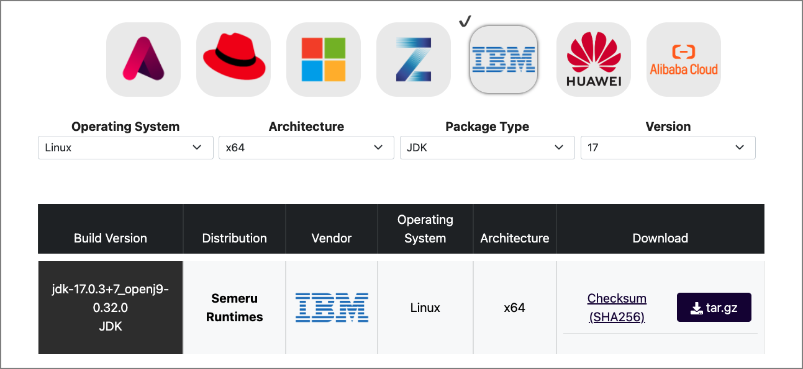

# IBM Semeru Runtimes Download Options

## What is IBM Semeru Runtimes?

[IBM Semeru Runtimes](https://www.ibm.com/support/pages/semeru-runtimes-getting-started/) is IBM's supported open source version of the Java SDK, and fully implements the Java Standard Edition (SE) APIs. It is available at no cost to developers, even for production use.

Similar to other vendor offerings and builds of OpenJDK, Semeru Runtimes is built on the latest open source release of the [OpenJDK](https://openjdk.java.net/) class libraries.

What separates Semeru Runtimes from the others is that it includes the highly rated Eclipse OpenJ9 JVM.

Another differentiator is the supported platforms. Besides the standard x86 and ARM architectures, it also supports AIX and Linux on IBM POWER, and Linux and z/OS on IBM Z systems.

## What is OpenJ9?

[OpenJ9](https://www.eclipse.org/openj9/) is an open source JVM provided by the Eclipse Foundation, and has been available since 2017.

OpenJ9 began life some 20+ years ago as simply J9. Developed by IBM, J9 has been used by all IBM Java based customers for all types of workloads - from medical, to banking and research.

As a major contributor to open source projects and for an open Java ecosystem, IBM moved the development and governance of the J9 JVM to the Eclipse Foundation, and it was renamed Eclipse OpenJ9.

## How does OpenJ9 compare against other JVMs?

Optimized for the cloud and running in constrained environments, OpenJ9 has the following advantages:

* Uses dramatically less memory without sacrificing application responsiveness.
* Provides AOT (Ahead of Time compilation) capabilities using shared cache between instances.
* Provides a remote JIT compiler (JITServer) to offload CPU cycles and memory spikes from the application instance.

## How do I get it?

IBM Semeru Runtimes can be freely downloaded, even for production use. The central download repository can be found on the [IBM Developer site](https://developer.ibm.com/languages/java/semeru-runtimes/downloads/).

Here you will find options for both Open and Certified Editions.

**Open Edition**:

* License: [GPLv2+CE](https://openjdk.java.net/legal/gplv2+ce.html)
* Java version: 8 (LTS), 11 (LTS), 16, 17 (LTS), 18
* Architecture: x64, x86, ppc64le, ppc64, s390x, aarch64
* Operating Systems: Linux, Windows, macOS, AIX

**Certified Edition**:
  
* License: [IBM](https://www14.software.ibm.com/cgi-bin/weblap/lap.pl?la_formnum=&li_formnum=L-PARM-C5ME22)
* Java version:  11 (LTS), 17 (LTS)
* Architecture: x64, ppc64le, ppc64, s390x, aarch64
* Operating Systems: Linux, AIX, z/OS

Additionally, the Certified Edition is available from the [Eclipse Adoptium Marketplace](https://adoptium.net/marketplace).

## What is the Eclipse Adoptium Marketplace?

The Eclipse Adoptium Working Group promotes and supports high-quality, TCK certified runtimes and associated technology for use across the Java ecosystem.

>**NOTE**: TCK stands for Technology Compatibility Kit - a suite of tests to ensure compliance with the latest Java specification.

Starting in May 2022, the Eclipse Adoptium Working Group launched a marketplace site where vendors can provide downloads to their JDK builds.

IBM Semeru Runtime Certified Edition is included, and will be the only offering that includes the Eclipse OpenJ9 JVM, as well as support for platforms such as IBM Z and POWER.

## Summary

If you want access to the latest release of IBM Semeru Runtimes, [IBM Developer](https://developer.ibm.com/languages/java/semeru-runtimes/downloads/) is still a primary site for downloads.

As of May 2022, the [Eclipse Adoptium Marketplace](https://adoptium.net/marketplace) provides a convenient alternative download site for the Certified Edition.

## Related articles

TBD
